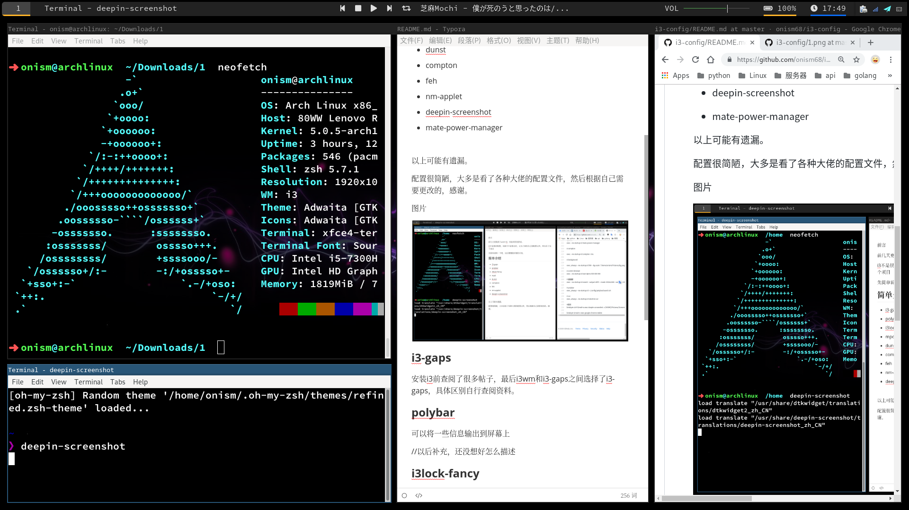

前言

前几天更换到了arch+i3，用起来很是舒适。

i3不是很好配置，对新手不是很友好，又为了备份自己的配置文件，所以有了这个项目

先简单说明一下吧，以后慢慢做详细的介绍。

## 简单介绍

- i3-gaps

- polybar

- i3lock-fancy

- xfce4-terminal

- mpd

- dunst

- compton

- feh

- nm-applet

- deepin-screenshot

- mate-power-manager

  

以上可能有遗漏。

配置很简陋，大多是看了各种大佬的配置文件，然后根据自己需要更改的，感谢。

图片

### i3-gaps

安装i3前查阅了很多帖子，最后i3wm和i3-gaps之间选择了i3-gaps，具体区别自行查阅资料。

### polybar

可以将一些信息输出到屏幕上

//以后补充，还没想好怎么描述

### i3lock-fancy

锁屏

### xfce4-terminal

支持终端透明

### mpd

//音乐

### dunst

消息弹框

### compton

终端透明

### feh

用来设置桌面背景图片

### nm-applet

显示网络图标

### deepin-screenshot

截屏工具，挺好用的

### mate-power-manager

电源管理图标